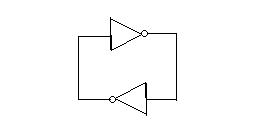
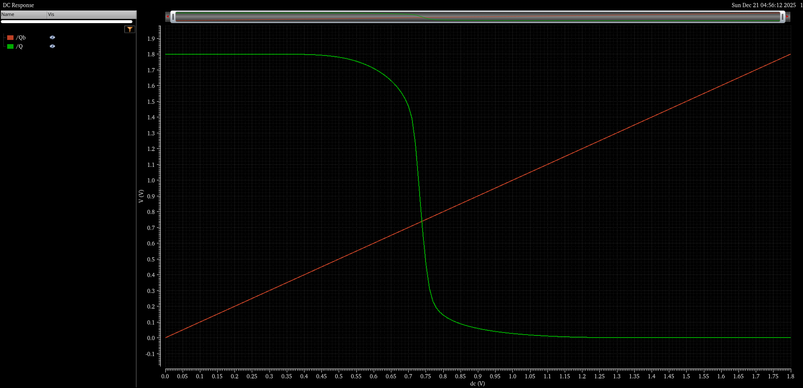
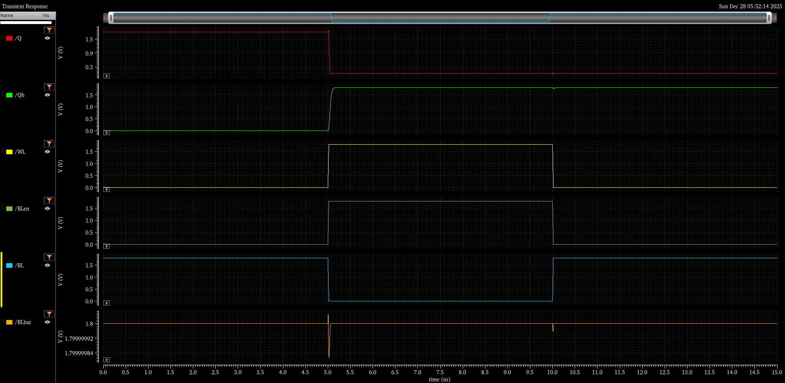
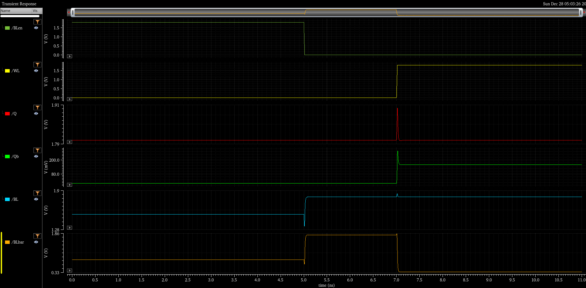
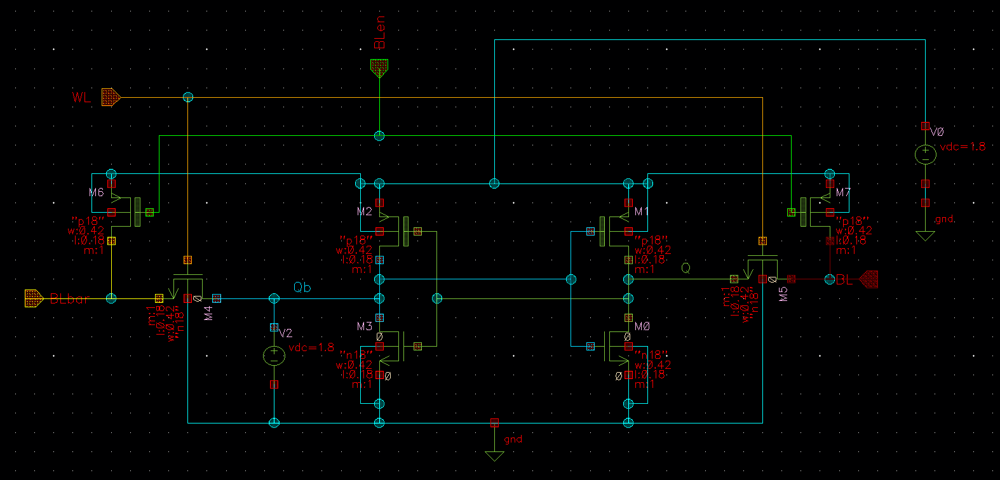
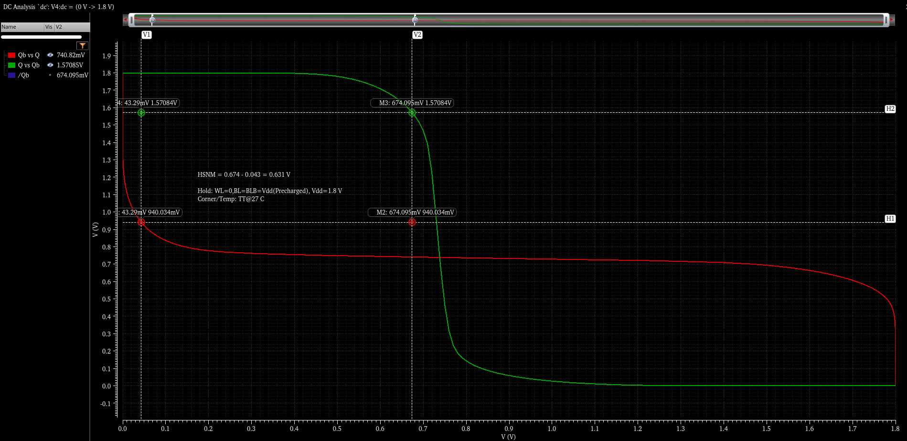
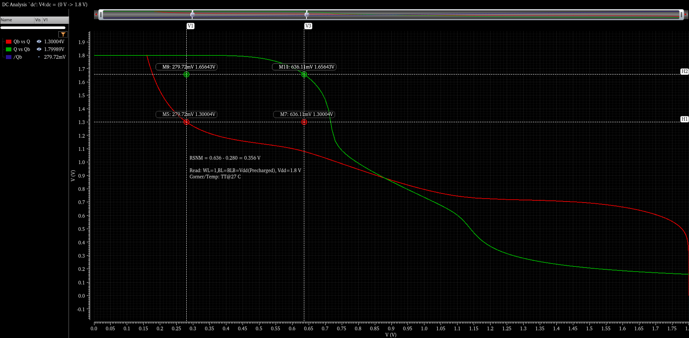
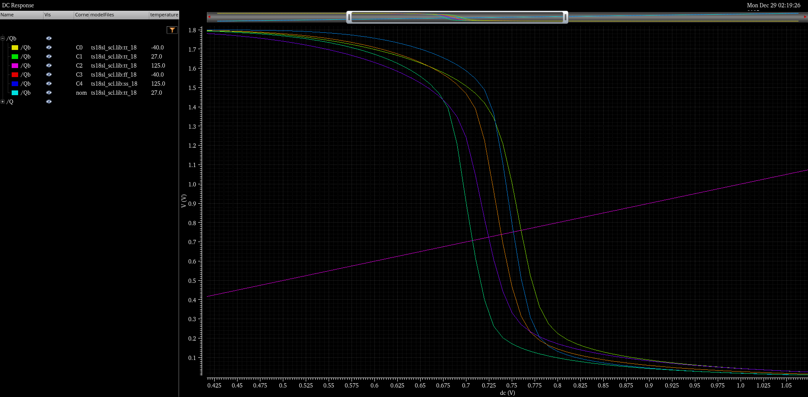

# 6T SRAM Bitcell Characterization (180 nm, Cadence Virtuoso)

**What I did:** Built a 6T SRAM bitcell testbench in Cadence Virtuoso, validated transient read/write behavior, and quantified stability using butterfly-curve SNM. Automated **HSNM/RSNM** extraction from CSV using a custom Python **max-square** extractor.

## Results snapshot (TT @ 27°C, VDD = 1.8 V)

| Metric | Value | How measured |
|---|---:|---|
| Hold SNM (HSNM) | 0.631 V | Butterfly curve at hold (WL=0), max-square |
| Read SNM (RSNM) | 0.356 V | Butterfly curve under read disturb (WL=1 + precharged BL/BLB), max-square |

Key takeaway: **RSNM < HSNM** due to read disturb when storage nodes connect to precharged bitlines during WL assertion.

## Artifacts in this repo
- Transient waveforms: **write ‘0’**, **read**
- Butterfly curves: **HSNM**, **RSNM** with max-square annotations
- PVT visualization: VTC/DC response shift across corners/temperature
- Python tool: `codes/snm_from_csv.py` (CSV → SNM + square corner points)

## Repo structure
- `figures/` → plots/screenshots used in this README  
- `codes/` → Python SNM extractor  
- `README.md`, `LICENSE`

---

## 1) What is a 6T SRAM bitcell?

A standard **6T SRAM** stores 1 bit using:
- **Two cross-coupled CMOS inverters (4 transistors)** → form a bistable latch  
- **Two access NMOS (2 transistors)** → connect the internal nodes to the bitlines during read/write

### 1.1 SRAM as a latch (core idea)
  
*Figure 1 — SRAM core is a bistable latch: two inverters feeding each other.*

The latch has **two stable states**:
- State A: **Q = 1, Qb = 0**
- State B: **Q = 0, Qb = 1**

This is why SRAM holds data without refresh (as long as VDD is present).

---

## 2) Why inverter VTC matters (and why SNM exists)

The inverter **Voltage Transfer Characteristic (VTC)** tells you:
- where the switching threshold (trip point) is
- how strongly the inverter regenerates a logic level
- how sensitive the latch is to noise/disturb

  
*Figure 2 — Inverter VTC from DC sweep (input swept, output measured).*

**Butterfly curves** (two VTCs plotted in a mirrored way) are the standard SRAM method to quantify stability via **Static Noise Margin (SNM)**:
- Bigger “max square” you can fit → more noise tolerance → more stable cell

---

## 3) 6T SRAM schematic + signal meanings

  
*Figure 3 — 6T SRAM bitcell testbench schematic (including bitline precharge + control signals).*

### 3.1 Internal nodes
- **Q, Qb**: complementary storage nodes (the “bit” lives here)

### 3.2 External/control signals
- **WL (Wordline)**: enables access transistors  
  - WL = 1 → cell connects to bitlines (read/write possible)  
  - WL = 0 → cell isolated (hold mode)
- **BL, BLbar**: differential bitlines used for read/write
- **BLen**: bitline precharge control (as implemented in the schematic)
  - Used to precharge BL/BLbar before read (and between operations)

> The exact polarity of BLen depends on how your precharge PMOS gates are wired.  
> In this testbench behavior (from waveforms), **precharge happens when BLen is LOW**.

---

## 4) Operations: hold, write, read

### 4.1 Hold (data retention)
- **WL = 0** → access devices OFF → latch isolated
- Bitlines can be precharged or left floating (implementation dependent)
- The latch feedback keeps Q/Qb stable

### 4.2 Write (force the latch)
To write a value:
1. Disable precharge (so BL/BLbar can be driven)
2. Drive bitlines differentially (e.g., write 0 → BL=0, BLbar=1)
3. Assert WL = 1 → access devices connect bitlines to internal nodes
4. Latch flips to match bitline forcing
5. Deassert WL and restore precharge

  
*Figure 4 — Write operation (write ‘0’ shown): WL asserted, BL forced low while BLbar high, Q discharges and Qb rises.*

**What this waveform demonstrates**
- **Correct write:** Q transitions to the intended value during WL high
- **Retention:** after WL returns low, Q/Qb stay latched

### 4.3 Read (sense without flipping)
Typical read sequence:
1. Precharge BL and BLbar (usually both to VDD)
2. Assert WL = 1
3. The node storing ‘0’ weakly discharges its connected bitline through the pull-down path
4. A small **bitline differential** develops (sense amplifier would detect it)

  
*Figure 5 — Read operation: bitlines precharged, WL asserted, one bitline discharges creating a differential while internal node remains stable (read disturb is visible but non-destructive).*

**What this waveform demonstrates**
- **Bitline differential develops** (the basis for sensing)
- **Read disturb exists** (internal node bumps), which is exactly why **RSNM < HSNM**

---

## 5) Simulation setup (Cadence Virtuoso)

### 5.1 Tools / conditions used
- **Cadence Virtuoso + Spectre**
- **PDK: 180 nm**
- **VDD = 1.8 V**
- **Corner/Temp baseline:** **TT @ 27°C** (as shown in the SNM figures)
- Additional PVT sweeps included for VTC shift visualization

### 5.2 Convergence + initialization
SRAM is a cross-coupled positive feedback system. Without guidance, the simulator can:
- land in a metastable point
- fail DC convergence
- start in the “wrong” stored state for a transient test

**What I used:**
- **Initial conditions (IC)** on **Q/Qb** to force a known stored state before applying WL/bitline activity  
  Example: to start with Q=1, Qb=0 → set IC accordingly.
- **Node set** (Convergence Aids) to help Spectre converge for DC/butterfly setups.

### 5.3 DC sweep configuration (for VTC and butterfly data export)
The butterfly curve is created from DC relationships between the two internal nodes. The setup used is captured here:

  
*Figure 6 — DC setup used to generate VTC/butterfly data for SNM extraction and CSV export.*

---

## 6) SNM results (TT, 27°C, VDD = 1.8 V)

### 6.1 Hold SNM (HSNM)
  
*Figure 7 — HOLD butterfly curve with max-square SNM annotation.*

- **HSNM ≈ 0.631 V** (from the annotated plot)

### 6.2 Read SNM (RSNM)
  
*Figure 8 — READ butterfly curve with max-square SNM annotation.*

- **RSNM ≈ 0.356 V** (from the annotated plot)

**Why RSNM is smaller:** during read, WL=1 connects internal nodes to precharged bitlines, creating a disturbance and reducing the stable noise margin.

---

## 7) PVT impact (VTC shift intuition)

  
*Figure 9 — DC response shift across process corners and temperatures (illustrates trip-point movement and slope changes).*

What this means in practice:
- Trip point shifts → read/write balance shifts
- Noise margin changes → stability changes
- This is why SRAM talks about **corner sign-off**, not a single plot

---

## 8) Python SNM extractor (CSV → HSNM/RSNM)

### 8.1 What the script does
`codes/snm_from_csv.py`:
- reads the two VTC curves from a CSV export
- interpolates onto a uniform grid
- splits the butterfly into left/right lobes
- finds the **maximum square** that fits in each lobe
- reports:
  - SNM (min of two lobes)
  - SNM_left, SNM_right
  - square placement corner points

### 8.2 CSV format expected
The script expects these exact columns (matching the exports in this repo):
- `Q vs Qb X`
- `Q vs Qb Y`
- `Qb vs Q X`
- `Qb vs Q Y`
